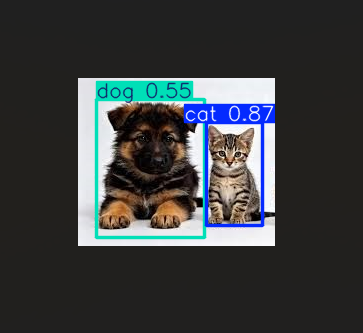

# 🐾 Animal Detection

An image-based animal detection system that identifies the animal present in a picture and displays its name using computer vision and deep learning.

## ✨ Features

- 🐶 Identifies animals from images
- 📷 Accepts animal pictures as input
- 🤖 Detects and classifies the animal
- 🏷️ Displays the detected animal's name
- ⚡ Fast and simple image-based detection

## 🛠️ Technologies Used

- Python
- OpenCV
- YOLO
- Deep Learning

## 🔍 How It Works

1. The user provides an animal image.
2. The image is processed using the trained detection model.
3. The model identifies the animal in the image.
4. The detected animal's name is displayed as the output.

## 📸 Demo
A real-time identification of animals:

